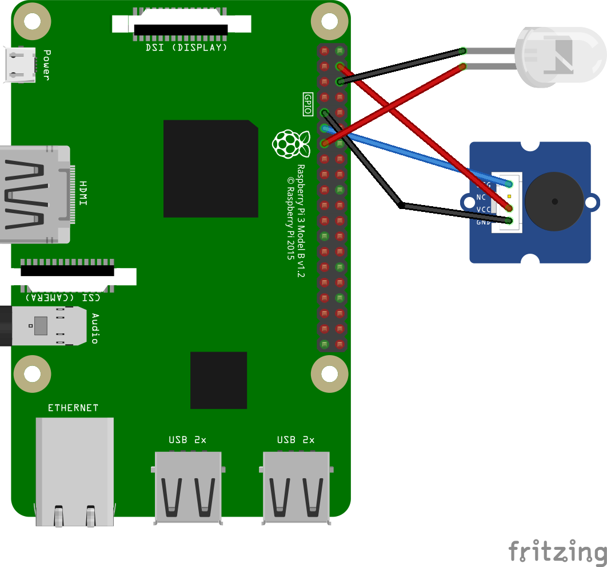

# beren-zik-detector

# Подготовка
Установите Raspberry PI OS Lite. 

Обязательно в Advanced Options (ctrl+shift+x):  
Пользователь: beren  
Пароль: The2ndlaw  
WIFI SSID: Cleverest Defense Systems  
WIFI PASS: The2ndlaw  
Name: BerenZIK  

# Провода


# Обновление системы и базовые пакеты
```
sudo apt update
sudo apt upgrade -y
sudo apt install -y git build-essential cmake g++ make pkg-config \
  libusb-1.0-0-dev libfftw3-dev libhackrf-dev \
  python3 python3-pip python3-dev python3-setuptools swig
```

# Немедленно добавляем udev правило (чтобы HackRF был доступен без sudo)

```
sudo tee /etc/udev/rules.d/52-hackrf.rules > /dev/null <<'EOF'
# HackRF One udev rule — allow access without sudo
SUBSYSTEM=="usb", ATTR{idVendor}=="1d50", ATTR{idProduct}=="6089", GROUP="plugdev", MODE="0666"
EOF

# перечитать правила и применить
sudo udevadm control --reload-rules
sudo udevadm trigger

# добавить пользователя beren в plugdev (если ещё не в группе)
sudo usermod -aG plugdev beren
```

# Установка/сборка SoapySDR (C++ библиотека + Python биндинги)

```
cd ~
git clone https://github.com/pothosware/SoapySDR.git
cd SoapySDR

mkdir -p build && cd build
cmake .. -DENABLE_PYTHON3=ON -DPYTHON_EXECUTABLE=/usr/bin/python3
make -j$(nproc)
sudo make install
sudo ldconfig
```
Проверка (находится ли SoapySDR C++):
```
SoapySDRUtil --info
```
Проверка импортa в Python:
```
python3 - <<'PY'
import SoapySDR
print("SoapySDR import OK")
PY
```
Если import SoapySDR сработал — биндинги доступны. Если ModuleNotFoundError, см. шаг ниже.

## если Python не видит SoapySDR
Если import SoapySDR всё ещё выдаёт ошибку, попробуй установить Python-биндинги вручную из папки swig/python:
```
cd ~/SoapySDR/swig/python/python3 || cd ~/SoapySDR/swig/python
# если в этой папке нет setup.py — биндинги генерируются CMake; вернись на шаг 3 и следи за выводом cmake.
# но если есть setup.py, то:
sudo python3 setup.py install
sudo ldconfig
```

И/или добавь путь, где установлен модуль, в PYTHONPATH:
```
# Примеры путей — уточнить по find, если нужно
sudo find /usr/local -name "SoapySDR*.so"
# затем:
echo 'export PYTHONPATH=$PYTHONPATH:/usr/local/lib/python3.13/site-packages' >> ~/.profile
source ~/.profile
```

# Установка и сборка SoapyHackRF (модуль Soapy для HackRF)
```
cd ~
git clone https://github.com/pothosware/SoapyHackRF.git
cd SoapyHackRF
mkdir -p build && cd build
cmake ..
make -j$(nproc)
sudo make install
sudo ldconfig
```
Проверка, что Soapy видит модуль HackRF:
```
SoapySDRUtil --check=hackrf
SoapySDRUtil --find
```
Ожидаемый --find:

```
Found device 0
  driver = hackrf
  label = HackRF One ...
```

# Установка Python библиотек для обработки сигналов (NumPy, SciPy, Matplotlib)

```
sudo apt install -y python3-numpy python3-scipy python3-matplotlib
```

# Права и подготовка скрипта main.py
Скопируй код main.py в корневую папку:
```
nano main.py
```

# Создать systemd-сервис beren.service (без логов)
```
sudo tee /etc/systemd/system/beren.service > /dev/null <<'EOF'
[Unit]
Description=Beren Main Python Service
After=network.target

[Service]
Type=simple
User=beren
WorkingDirectory=/home/beren
ExecStart=/usr/bin/python3 /home/beren/main.py
Restart=always
RestartSec=5
Environment=PYTHONUNBUFFERED=1
StandardOutput=null
StandardError=null

[Install]
WantedBy=multi-user.target
EOF
```

Активировать сервис:
```
sudo systemctl daemon-reload
sudo systemctl enable beren.service
sudo systemctl start beren.service
```

Проверка статуса (однократная проверка, не держи постоянно):
```
sudo systemctl status beren.service --no-pager
```

Если нужно перезапустить вручную:
```
sudo systemctl restart beren.service
``` 
